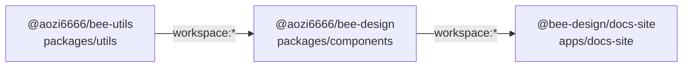
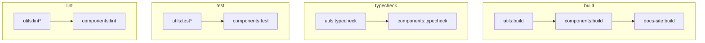

# Architecture — Bee Design (Cream_Design)

> Machine-readable architecture reference for agents and tooling.
> Source of truth is always the actual `package.json` and source files — update this document when structural changes occur (see [Maintenance](#maintenance)).
> Chinese narrative version: `docs/架构说明.md`

---

## 1. Workspace Topology

```
bee-design-workspace  (pnpm 9.x, ESM, Turborepo)
│
├── packages/
│   ├── utils/        @aozi6666/bee-utils     v0.1.0  (published)
│   └── components/   @aozi6666/bee-design    v0.3.1  (published)
│
└── apps/
    └── docs-site/    @bee-design/docs-site   (private, Storybook)
```

**Dependency direction (strict, one-way):**



> Rule: `utils` must never import from `components`. Violation breaks the build contract.

---

## 2. Package Layer

### 2.1 `@aozi6666/bee-utils` — `packages/utils`

Pure utility functions with no UI dependency.

**Public API** (`src/index.ts`):

| Export                       | Category | Description                                        |
| ---------------------------- | -------- | -------------------------------------------------- |
| `clamp(n, min, max)`         | number   | Clamp a number to a range                          |
| `pick(obj, keys)`            | object   | Pick keys from an object                           |
| `omit(obj, keys)`            | object   | Omit keys from an object                           |
| `mergeRefs(...refs)`         | react    | Merge multiple React refs into one callback ref    |
| `composeEventHandlers(a, b)` | react    | Compose two event handlers, calling both           |
| `getScrollParent(el)`        | dom      | Walk up DOM tree to find first scrollable ancestor |

**Package exports** (`package.json`):

```json
{
  "main": "dist/cjs/index.js",
  "module": "dist/index.js",
  "types": "dist/index.d.ts",
  "exports": {
    ".": {
      "types": "./dist/index.d.ts",
      "import": "./dist/index.js",
      "require": "./dist/cjs/index.js"
    }
  }
}
```

---

### 2.2 `@aozi6666/bee-design` — `packages/components`

React UI component library with internationalization support.

**Public API** (`src/index.ts`):

| Export                                            | Type      | Notes                                                  |
| ------------------------------------------------- | --------- | ------------------------------------------------------ |
| `Button`                                          | Component | variant: default / primary / danger / link             |
| `Input`                                           | Component | prefix / suffix slot support                           |
| `Menu`                                            | Component | horizontal / vertical modes, submenus                  |
| `AutoComplete`                                    | Component | async suggestions via `fetchSuggestions`               |
| `Upload`                                          | Component | click + drag-and-drop, chunked upload support          |
| `Icon`                                            | Component | FontAwesome wrapper (`@fortawesome/react-fontawesome`) |
| `Progress`                                        | Component | progress bar                                           |
| `Transition`                                      | Component | `react-transition-group` wrapper                       |
| `ConfigProvider`                                  | Component | Theme and i18n context provider                        |
| `useLocale`                                       | Hook      | Consume locale from ConfigProvider context             |
| `zhCN` / `enUS`                                   | Locale    | Built-in locale packs                                  |
| `setupIcons`                                      | Function  | Register FontAwesome icon library                      |
| `BeeLocale`, `DeepPartial`, `ConfigProviderProps` | Types     | Public TypeScript types                                |

**Peer dependencies**: `react ^18 || ^19`, `react-dom ^18 || ^19`

**Runtime dependencies** (externalized from all bundles):

```
react              react-dom          axios
classnames         lodash             @aozi6666/bee-utils
react-transition-group
@fortawesome/fontawesome-svg-core
@fortawesome/free-solid-svg-icons
@fortawesome/react-fontawesome
```

**Package exports** (`package.json`):

```json
{
  "main": "dist/index.cjs",
  "module": "dist/index.esm.js",
  "unpkg": "dist/index.umd.js",
  "types": "dist/index.d.ts",
  "exports": {
    ".": {
      "types": "./dist/index.d.ts",
      "import": "./dist/index.esm.js",
      "require": "./dist/index.cjs"
    },
    "./style.css": "./dist/index.css"
  }
}
```

---

### 2.3 `@bee-design/docs-site` — `apps/docs-site`

Storybook 10 documentation site. Private package, not published to npm.

- **Dev server**: `storybook dev -p 6006` → `http://localhost:6006`
- **Static build**: `storybook build` → `storybook-static/`
- **Deployed to**: GitHub Pages (`https://<owner>.github.io/<repo>/`)
- **Story tests**: Vitest + Playwright (`test:storybook`)
- **Depends on**: `@aozi6666/bee-design workspace:*`, React 19, highlight.js

---

## 3. Build Pipeline

### 3.1 `@aozi6666/bee-utils` — tsc only

```
src/index.ts
    │
    ├── tsc -p tsconfig.build.json  ──→  dist/index.js          (ESM)
    │                                    dist/index.d.ts         (types)
    │
    └── tsc -p tsconfig.cjs.json   ──→  dist/cjs/index.js       (CJS)
```

Single command: `pnpm build` = `rimraf dist && tsc (ESM) && tsc (CJS)`

---

### 3.2 `@aozi6666/bee-design` — tsc + Rollup + Sass

Full build sequence (`pnpm build`):

```
Step 1 — Types
  tsc -p tsconfig.build.json
  └──→ dist/index.d.ts  (declarations only; JS emission disabled)

Step 2 — Bundle (3 parallel Rollup processes)
  Entry: src/index.ts
  Plugins: typescript2 (tsconfig.rollup.json) · nodeResolve · commonjs · json · sass
  Excludes: *.test.tsx, *.stories.tsx, setupTests.ts

  ├── rollup.esm.config.js
  │   + excludeDependenciesFromBundle()
  │   └──→ dist/index.esm.js  (ES module, sourcemap)
  │
  ├── rollup.cjs.config.js
  │   + excludeDependenciesFromBundle()
  │   └──→ dist/index.cjs     (CommonJS, sourcemap)
  │
  └── rollup.umd.config.js
      + replace(process.env.NODE_ENV → "production")
      Global name: BeeDesign
      UMD globals: { react→React, react-dom→ReactDOM, axios→Axios,
                     classnames→classNames, lodash→lodash,
                     @aozi6666/bee-utils→BeeUtils }
      └──→ dist/index.umd.js  (UMD, sourcemap)

Step 3 — CSS
  sass src/styles/index.scss dist/index.css --no-source-map
  └──→ dist/index.css
```

**Build outputs summary:**

| File                | Format     | Use case                            |
| ------------------- | ---------- | ----------------------------------- |
| `dist/index.esm.js` | ES Module  | Bundlers (Vite, Rollup, Webpack)    |
| `dist/index.cjs`    | CommonJS   | Node.js / legacy bundlers           |
| `dist/index.umd.js` | UMD        | CDN (`<script>` tag, `unpkg`)       |
| `dist/index.d.ts`   | TypeScript | Type declarations                   |
| `dist/index.css`    | CSS        | Compiled styles (import separately) |

> Styles must be imported manually: `import '@aozi6666/bee-design/style.css'`

---

## 4. Turborepo Task Graph

Configuration: `turbo.json` — all four tasks use `dependsOn: ["^<task>"]` (upstream-first).



> \* `utils` has no test or lint scripts currently; Turbo skips gracefully.

**Cache behavior:**

- Cached outputs: `dist/**`, `storybook-static/**`
- `typecheck`, `lint`, `test` produce no output artifacts (no cache beyond hit/miss)
- Run with `--force` to bypass cache: `turbo run build --force`

**Key commands:**

```bash
pnpm turbo:build       # turbo run build      (respects ^build order)
pnpm turbo:typecheck   # turbo run typecheck
pnpm turbo:lint        # turbo run lint
pnpm turbo:test        # turbo run test
```

---

## 5. Quality Layer

### Pre-commit (Husky + lint-staged)

Runs automatically on `git commit`:

| File glob                  | Actions                                |
| -------------------------- | -------------------------------------- |
| `*.{js,jsx,ts,tsx}`        | `eslint --fix` → `prettier --write`    |
| `*.{css,scss}`             | `stylelint --fix` → `prettier --write` |
| `*.{json,md,mdx,yml,yaml}` | `prettier --write`                     |

### Commit message (commitlint)

Format enforced: `<type>(<scope>): <subject>`

Types: `feat` `fix` `docs` `chore` `test` `refactor` `style` `perf`  
Scopes: component name lowercase, or `utils` / `components` / `docs` / `build`

### Unit tests — `packages/components`

- Framework: **Jest 30** + **ts-jest** (ESM preset) + **jsdom**
- Setup: `src/setupTests.ts`
- Testing Library: `@testing-library/react` + `@testing-library/jest-dom`
- Module resolution: `@aozi6666/bee-utils` → `../utils/dist/cjs/index.js`

> **Pre-condition**: `pnpm utils:build` must run before tests. The `moduleNameMapper`
> points directly to the CJS build artifact — tests fail if it doesn't exist.

### Pre-release pipeline (`pnpm release`)

```
utils:typecheck → utils:build
    → components:typecheck → components:test:ci → components:lint → components:build
```

---

## 6. CI Layer

### `ci.yml` — Verify (push / PR → main)

```
checkout
  → pnpm install --frozen-lockfile  (HUSKY=0)
  → pnpm release                    (full verify + build)
  → pnpm docs:build                 (Storybook static)
```

### `deploy-docs.yml` — Publish Storybook (push → main / manual)

```
checkout → install
  → utils:typecheck → utils:build
  → components:typecheck → components:test:ci → components:lint → components:build
  → docs:build  (env: STORYBOOK_BASE_PATH=/<repo>/)
  → upload-pages-artifact (path: apps/docs-site/storybook-static)
  → deploy-pages
```

Deployed URL: `https://<owner>.github.io/<repo>/`

### `publish-components.yml` — npm publish (manual / tag)

Publishes `@aozi6666/bee-design` to npm. Triggered manually or on tag push.

---

## 7. Architectural Invariants

These constraints must not be violated without an OpenSpec proposal:

1. **Dependency direction**: `utils` ← `components` ← `docs-site` (strictly one-way)
2. **No bundled peers**: `react` and `react-dom` must never appear in bundle output
3. **No bundled dependencies**: All `dependencies` must be in Rollup `external` arrays
4. **Dual format**: `bee-utils` ships ESM + CJS; `bee-design` ships ESM + CJS + UMD
5. **Types co-shipped**: Both packages include `.d.ts` declarations in their `dist/`
6. **Style opt-in**: CSS is a separate entry (`./style.css`), never auto-imported by JS entry
7. **Test isolation**: Jest tests run against the real `bee-utils` CJS build, not mocks

---

## 8. Maintenance

Update this document when any of the following changes:

- A workspace package is added or removed (`packages/`, `apps/`)
- Package name, `version`, or `exports` fields change
- Build toolchain changes (Rollup → Vite, tsc flags, Sass pipeline)
- A new root script is added or an existing one changes behavior
- Turborepo `dependsOn` graph changes
- CI workflow triggers or job structure change

> If you make a structural change via OpenSpec, add a task in `tasks.md`:
> `- [ ] Update docs/ARCHITECTURE.md to reflect <change>`
